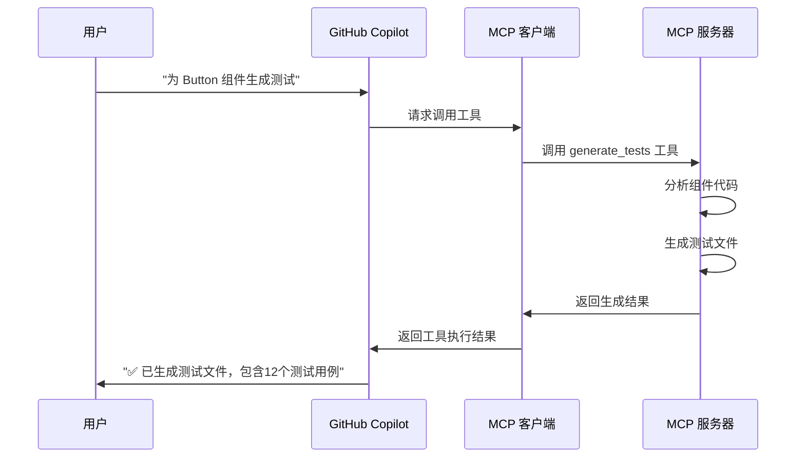

# MCP (Model Context Protocol) 详解

## 🤔 什么是 MCP？

**Model Context Protocol (MCP)** 是一个开放标准协议，它让 AI 助手（如 GitHub Copilot、Claude 等）能够安全地访问和使用本地工具、资源和数据。

### 🎯 简单理解 MCP

想象一下：
- **没有 MCP 之前**：AI 只能基于你给它的文本信息来回答问题
- **有了 MCP 之后**：AI 可以主动调用你本地的工具、读取文件、运行脚本、访问数据库等

就像给 AI 装了"手脚"，让它不仅能"思考"，还能"行动"。

---

## 🏗️ MCP 架构原理

### 📋 基本架构

```
┌─────────────────┐    ┌─────────────────┐    ┌─────────────────┐
│   AI 助手       │    │   MCP 客户端    │    │   MCP 服务器    │
│  (Copilot)      │◄──►│  (VS Code)      │◄──►│  (你的工具)     │
└─────────────────┘    └─────────────────┘    └─────────────────┘
```

1. **AI 助手**: GitHub Copilot 或其他 AI
2. **MCP 客户端**: VS Code 等编辑器，负责通信
3. **MCP 服务器**: 你编写的工具服务器，提供具体功能

### 🔄 工作流程



---

## 🎪 具体到你的场景

### 🔍 你的问题
你提到："除了核心开发阶段外，其他阶段都是重复的劳动力，并且是使用 AI 生成的"

### 💡 MCP 的解决方案

**现在的工作流**：
```
1. 开发 Nav 组件 ✅ (手动)
2. 需要生成 Demo → 复制粘贴 prompt 到 AI → 复制结果 → 手动创建文件
3. 需要生成测试 → 复制粘贴 prompt 到 AI → 复制结果 → 手动创建文件
4. 需要生成 Story → 复制粘贴 prompt 到 AI → 复制结果 → 手动创建文件
5. 更新文档 → 复制粘贴 prompt 到 AI → 复制结果 → 手动更新
```

**使用 MCP 后的工作流**：
```
1. 开发 Nav 组件 ✅ (手动)
2. 对 Copilot 说："为 Nav 组件执行完整工作流" → ✨ 自动完成 2-5 步
```

### 🚀 实际对话示例

**你的操作**：
```
💬 用户: @workspace 我刚完成了 Button 组件的开发，请帮我生成相关文件
```

**Copilot 的响应**：
```
🤖 Copilot: 好的！我来为 Button 组件生成所有相关文件。

🔍 正在分析组件代码...
   - 检测到 ButtonProps 接口
   - 发现 8 个属性：size, type, disabled, onClick 等
   - 识别到 2 个自定义 hooks

📝 生成演示文件...
   ✅ 创建 demo/ButtonDemo.tsx
   ✅ 包含基础用法、大小变体、禁用状态等 5 个示例

🧪 生成单元测试...
   ✅ 创建 src/components/Button/__tests__/Button.test.tsx  
   ✅ 生成渲染测试、属性测试、事件测试、无障碍测试

📚 生成 Storybook...
   ✅ 创建 stories/Button.stories.tsx
   ✅ 包含 Controls、Actions 和文档页面

📖 更新文档...
   ✅ 更新 docs/API_REFERENCE.md
   ✅ 添加 Button 组件完整 API 文档

✨ 完成！所有文件已生成并通过质量检查
```

---

## 🛠️ MCP 服务器是什么？

### 📝 简单理解

MCP 服务器就是一个 **Node.js 程序**，它：

1. **监听** AI 的请求
2. **执行** 具体的任务（分析代码、生成文件等）  
3. **返回** 执行结果给 AI

### 🔧 基础结构

```typescript
// 这就是一个 MCP 服务器的核心
import { Server } from '@modelcontextprotocol/sdk/server/index.js';

const server = new Server({
  name: 'component-helper',  // 服务器名称
  version: '1.0.0',
}, {
  capabilities: {
    tools: {
      // 定义工具：生成演示文件
      generate_demo: {
        description: '为组件生成演示文件',
        inputSchema: {
          type: 'object',
          properties: {
            componentName: { type: 'string' }  // 输入：组件名称
          }
        }
      }
    }
  }
});

// 处理工具调用
server.setRequestHandler('tools/call', async (request) => {
  if (request.params.name === 'generate_demo') {
    const { componentName } = request.params.arguments;
    
    // 1. 读取组件代码
    const componentCode = await readFile(`src/components/${componentName}/${componentName}.tsx`);
    
    // 2. 分析组件结构
    const props = analyzeComponentProps(componentCode);
    
    // 3. 生成演示代码
    const demoCode = generateDemoTemplate(componentName, props);
    
    // 4. 写入文件
    await writeFile(`demo/${componentName}Demo.tsx`, demoCode);
    
    return { success: true, path: `demo/${componentName}Demo.tsx` };
  }
});
```

---

## 🎯 为什么选择 MCP？

### ✅ 符合你的现状

1. **团队已经在用 AI**：MCP 是对现有工作流的升级，不是替换
2. **自然语言交互**：团队成员继续用熟悉的对话方式
3. **无学习成本**：不需要学新工具，在 VS Code 里直接用

### 🚀 核心优势

| 对比项 | 传统脚本 | MCP 方案 |
|--------|----------|----------|
| **使用方式** | `npm run generate:demo Nav` | `@workspace 为 Nav 生成演示` |
| **智能程度** | 固定模板 | AI 理解上下文，生成个性化代码 |
| **问题处理** | 手动调试脚本 | AI 自动检测和修复问题 |
| **团队接受度** | 需要学命令 | 自然语言，零学习成本 |
| **扩展性** | 修改代码 | 对话式配置和优化 |

### 🔄 渐进式升级

```
阶段1: 现在
开发组件 → 手动复制粘贴 prompt → 手动创建文件

阶段2: 使用 MCP  
开发组件 → 对话式自动生成 → AI 自动创建文件

阶段3: 未来扩展
AI 主动发现问题 → 建议优化 → 自动重构
```

---

## 🎪 技术实现难度

### 📊 复杂度评估

| 组件 | 难度 | 说明 |
|------|------|------|
| **基础 MCP 服务器** | ⭐⭐☆☆☆ | 使用官方 SDK，主要是配置 |
| **代码分析器** | ⭐⭐⭐☆☆ | 使用 Babel 解析 AST |
| **文件生成器** | ⭐⭐☆☆☆ | 模板替换，相对简单 |
| **AI 集成** | ⭐⭐⭐⭐☆ | 需要 OpenAI API，但有大量例子 |

### ⏱️ 开发时间估算

```
MVP 版本 (核心功能): 3-5 天
├── MCP 服务器搭建: 1 天
├── 组件分析器: 1-2 天  
├── Demo 生成器: 1 天
└── VS Code 配置: 0.5 天

完整版本: 2-3 周
├── 测试生成器: 3-4 天
├── Story 生成器: 2-3 天
├── 文档生成器: 2-3 天
├── AI 智能优化: 3-5 天
└── 测试和优化: 2-3 天
```

---

## 🚀 快速验证方案

### 🔍 第一步：验证可行性（半天）

创建一个最简单的 MCP 服务器：

```bash
# 1. 创建项目
mkdir mcp-demo && cd mcp-demo
npm init -y

# 2. 安装依赖
npm install @modelcontextprotocol/sdk

# 3. 创建简单服务器
# 只实现一个功能：读取组件代码并返回分析结果
```

### 🎯 验证目标

- ✅ VS Code 能连接到 MCP 服务器
- ✅ Copilot 能调用自定义工具
- ✅ 能读取和分析组件代码

### 📝 验证脚本

```typescript
// 最简单的 MCP 服务器
const server = new Server({
  name: 'demo',
  version: '1.0.0'
}, {
  capabilities: {
    tools: {
      analyze_component: {
        description: '分析组件代码',
        inputSchema: {
          type: 'object',
          properties: {
            componentName: { type: 'string' }
          }
        }
      }
    }
  }
});

server.setRequestHandler('tools/call', async (request) => {
  if (request.params.name === 'analyze_component') {
    const { componentName } = request.params.arguments;
    // 简单返回组件信息
    return {
      name: componentName,
      props: ['size', 'type', 'disabled'],
      hooks: ['useState', 'useCallback']
    };
  }
});
```

---

## 💡 总结

### 🎯 MCP 本质上是什么？

MCP 就是让 **AI 能调用你的本地工具** 的桥梁。

对你来说：
- **输入**：自然语言指令（"为 Button 生成测试"）
- **输出**：实际的文件和代码（自动创建测试文件）
- **过程**：AI 理解你的需求，调用你编写的工具来完成任务

### 🚀 为什么适合你？

1. **基于现有习惯**：团队已经在用 AI，MCP 是自然升级
2. **解决实际痛点**：自动化重复工作，提升效率
3. **技术可行**：基于熟悉的 Node.js 和 TypeScript
4. **风险可控**：可以小步试验，逐步完善

### 🎪 下一步建议

1. **花半天时间**搭建一个最简单的 MCP 服务器
2. **验证连通性**：确保 VS Code + Copilot 能调用你的工具
3. **实现一个功能**：比如组件代码分析
4. **逐步扩展**：添加文件生成、测试等功能

这样你就能用最小的投入验证 MCP 是否真的能解决你的问题！
