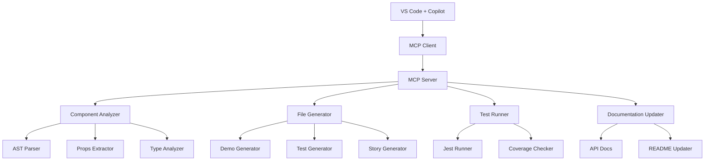

# Fluentui Plus 组件库 MCP 自动化实现方案

## 🎯 方案概述

基于你的更新需求，这是一个专门针对 **Model Context Protocol (MCP)** 的实现方案，让 GitHub Copilot 能够自动化处理组件库开发中的重复性工作。

### 🎪 核心价值
- **无缝集成**：直接在 VS Code 中与 Copilot 对话完成自动化任务
- **智能理解**：AI 能理解组件代码结构和业务逻辑
- **团队共享**：团队成员都能通过自然语言与 AI 协作
- **渐进增强**：在现有 AI 工作流基础上升级

---

## 🏗️ MCP 架构设计

### 📋 系统架构图



### 🛠️ MCP 服务器核心组件

```typescript
// mcp-server/src/index.ts
import { Server } from '@modelcontextprotocol/sdk/server/index.js';
import { StdioServerTransport } from '@modelcontextprotocol/sdk/server/stdio.js';
import { 
  ComponentAnalyzer,
  DemoGenerator,
  TestGenerator,
  StoryGenerator,
  DocsUpdater 
} from './generators/index.js';

const server = new Server({
  name: 'fluentui-plus-assistant',
  version: '1.0.0',
}, {
  capabilities: {
    tools: {
      analyze_component: {
        description: '分析组件代码结构，提取 Props、Hooks 等信息',
        inputSchema: {
          type: 'object',
          properties: {
            componentName: { type: 'string', description: '组件名称' },
            componentPath: { type: 'string', description: '组件路径' }
          },
          required: ['componentName']
        }
      },
      generate_demo: {
        description: '为组件生成演示文件',
        inputSchema: {
          type: 'object',
          properties: {
            componentName: { type: 'string' },
            demoType: { 
              type: 'string', 
              enum: ['basic', 'advanced', 'interactive'],
              default: 'basic'
            }
          },
          required: ['componentName']
        }
      },
      generate_tests: {
        description: '为组件生成单元测试',
        inputSchema: {
          type: 'object',
          properties: {
            componentName: { type: 'string' },
            testTypes: {
              type: 'array',
              items: { enum: ['render', 'props', 'events', 'accessibility'] },
              default: ['render', 'props']
            }
          },
          required: ['componentName']
        }
      },
      generate_story: {
        description: '为组件生成 Storybook Stories',
        inputSchema: {
          type: 'object',
          properties: {
            componentName: { type: 'string' },
            storyTypes: {
              type: 'array',
              items: { enum: ['default', 'variants', 'controls', 'docs'] },
              default: ['default', 'variants']
            }
          },
          required: ['componentName']
        }
      },
      update_docs: {
        description: '更新组件 API 文档',
        inputSchema: {
          type: 'object',
          properties: {
            componentName: { type: 'string' },
            docSections: {
              type: 'array',
              items: { enum: ['api', 'examples', 'props', 'methods'] },
              default: ['api', 'props']
            }
          },
          required: ['componentName']
        }
      },
      run_component_workflow: {
        description: '执行完整的组件开发工作流',
        inputSchema: {
          type: 'object',
          properties: {
            componentName: { type: 'string' },
            stages: {
              type: 'array',
              items: { enum: ['demo', 'test', 'story', 'docs'] },
              default: ['demo', 'test', 'story', 'docs']
            },
            autoFix: { type: 'boolean', default: true },
            runTests: { type: 'boolean', default: true }
          },
          required: ['componentName']
        }
      },
      validate_component: {
        description: '验证组件质量，包括测试、类型检查、代码规范',
        inputSchema: {
          type: 'object',
          properties: {
            componentName: { type: 'string' },
            checks: {
              type: 'array',
              items: { enum: ['tests', 'types', 'lint', 'accessibility'] },
              default: ['tests', 'types', 'lint']
            }
          },
          required: ['componentName']
        }
      }
    },
    resources: {
      component_templates: {
        description: '组件模板资源'
      },
      project_config: {
        description: '项目配置信息'
      }
    }
  },
});
```

---

## 🔧 核心工具实现

### 1. 组件分析器

```typescript
// mcp-server/src/analyzers/ComponentAnalyzer.ts
import * as parser from '@babel/parser';
import traverse from '@babel/traverse';
import * as t from '@babel/types';
import * as fs from 'fs/promises';
import * as path from 'path';

export class ComponentAnalyzer {
  async analyzeComponent(componentName: string, componentPath?: string): Promise<ComponentInfo> {
    const resolvedPath = componentPath || this.resolveComponentPath(componentName);
    
    // 读取组件文件
    const componentCode = await fs.readFile(
      path.join(resolvedPath, `${componentName}.tsx`), 
      'utf-8'
    );
    
    // 解析 AST
    const ast = parser.parse(componentCode, {
      sourceType: 'module',
      plugins: ['typescript', 'jsx']
    });
    
    const componentInfo: ComponentInfo = {
      name: componentName,
      path: resolvedPath,
      props: [],
      hooks: [],
      methods: [],
      imports: [],
      exports: []
    };
    
    // 遍历 AST 提取信息
    traverse(ast, {
      // 提取 Props 接口
      TSInterfaceDeclaration(path) {
        if (path.node.id.name.endsWith('Props')) {
          componentInfo.props = this.extractPropsFromInterface(path.node);
        }
      },
      
      // 提取 Hooks 使用
      CallExpression(path) {
        if (t.isIdentifier(path.node.callee) && 
            path.node.callee.name.startsWith('use')) {
          componentInfo.hooks.push({
            name: path.node.callee.name,
            args: path.node.arguments.map(arg => this.nodeToString(arg))
          });
        }
      },
      
      // 提取导入
      ImportDeclaration(path) {
        componentInfo.imports.push({
          source: path.node.source.value,
          specifiers: path.node.specifiers.map(spec => ({
            type: spec.type,
            name: this.getSpecifierName(spec)
          }))
        });
      },
      
      // 提取组件函数
      FunctionDeclaration(path) {
        if (path.node.id?.name === componentName) {
          componentInfo.methods = this.extractMethodsFromFunction(path.node);
        }
      }
    });
    
    return componentInfo;
  }
  
  private resolveComponentPath(componentName: string): string {
    return path.join(process.cwd(), 'src', 'components', componentName);
  }
  
  private extractPropsFromInterface(node: t.TSInterfaceDeclaration): PropInfo[] {
    // 实现 Props 提取逻辑
    return [];
  }
  
  // ... 其他辅助方法
}

interface ComponentInfo {
  name: string;
  path: string;
  props: PropInfo[];
  hooks: HookInfo[];
  methods: MethodInfo[];
  imports: ImportInfo[];
  exports: ExportInfo[];
}
```

### 2. Demo 生成器

```typescript
// mcp-server/src/generators/DemoGenerator.ts
import { ComponentInfo } from '../types/ComponentInfo';
import { FileGenerator } from './FileGenerator';

export class DemoGenerator extends FileGenerator {
  async generateDemo(componentInfo: ComponentInfo, demoType: 'basic' | 'advanced' | 'interactive' = 'basic'): Promise<string> {
    const template = await this.loadTemplate('demo', demoType);
    
    const demoContent = template
      .replace(/{{componentName}}/g, componentInfo.name)
      .replace(/{{componentImport}}/g, this.generateImportStatement(componentInfo))
      .replace(/{{demoExamples}}/g, this.generateDemoExamples(componentInfo, demoType));
    
    const demoPath = `demo/${componentInfo.name}Demo.tsx`;
    await this.writeFile(demoPath, demoContent);
    
    return demoPath;
  }
  
  private generateDemoExamples(componentInfo: ComponentInfo, demoType: string): string {
    switch (demoType) {
      case 'basic':
        return this.generateBasicDemo(componentInfo);
      case 'advanced':
        return this.generateAdvancedDemo(componentInfo);
      case 'interactive':
        return this.generateInteractiveDemo(componentInfo);
      default:
        return this.generateBasicDemo(componentInfo);
    }
  }
  
  private generateBasicDemo(componentInfo: ComponentInfo): string {
    const examples = componentInfo.props
      .filter(prop => prop.required)
      .map(prop => `${prop.name}={${this.getDefaultValue(prop)}}`)
      .join('\n    ');
    
    return `
export const BasicDemo = () => {
  return (
    <div>
      <h3>基础用法</h3>
      <${componentInfo.name}
        ${examples}
      />
    </div>
  );
};`;
  }
  
  private generateAdvancedDemo(componentInfo: ComponentInfo): string {
    // 生成高级示例，包含所有 Props
    return `// 高级示例实现`;
  }
  
  private generateInteractiveDemo(componentInfo: ComponentInfo): string {
    // 生成交互式示例，包含状态管理
    return `// 交互式示例实现`;
  }
}
```

### 3. 测试生成器

```typescript
// mcp-server/src/generators/TestGenerator.ts
export class TestGenerator extends FileGenerator {
  async generateTests(
    componentInfo: ComponentInfo, 
    testTypes: string[] = ['render', 'props']
  ): Promise<string> {
    const testContent = this.generateTestSuite(componentInfo, testTypes);
    const testPath = `src/components/${componentInfo.name}/__tests__/${componentInfo.name}.test.tsx`;
    
    await this.ensureDirectory(path.dirname(testPath));
    await this.writeFile(testPath, testContent);
    
    return testPath;
  }
  
  private generateTestSuite(componentInfo: ComponentInfo, testTypes: string[]): string {
    const imports = this.generateTestImports(componentInfo);
    const tests = testTypes.map(type => this.generateTestCase(componentInfo, type)).join('\n\n');
    
    return `${imports}

describe('${componentInfo.name}', () => {
${tests}
});`;
  }
  
  private generateTestCase(componentInfo: ComponentInfo, testType: string): string {
    switch (testType) {
      case 'render':
        return this.generateRenderTest(componentInfo);
      case 'props':
        return this.generatePropsTest(componentInfo);
      case 'events':
        return this.generateEventTest(componentInfo);
      case 'accessibility':
        return this.generateA11yTest(componentInfo);
      default:
        return '';
    }
  }
  
  private generateRenderTest(componentInfo: ComponentInfo): string {
    const requiredProps = componentInfo.props
      .filter(prop => prop.required)
      .map(prop => `${prop.name}: ${this.getTestValue(prop)}`)
      .join(', ');
    
    return `  test('should render correctly', () => {
    const props = { ${requiredProps} };
    const { container } = render(<${componentInfo.name} {...props} />);
    expect(container.firstChild).toBeInTheDocument();
  });`;
  }
}
```

---

## 🎨 VS Code 集成配置

### MCP 客户端配置

```json
// .vscode/settings.json
{
  "mcp.servers": {
    "fluentui-plus-assistant": {
      "command": "node",
      "args": ["./mcp-server/dist/index.js"],
      "env": {
        "NODE_ENV": "development"
      }
    }
  },
  "github.copilot.chat.welcomeMessage": "你好！我可以帮助你自动化 Fluentui Plus 组件库的开发工作流。\n\n可用命令：\n- 分析组件：`@fluentui-plus 分析 Nav 组件`\n- 生成 Demo：`@fluentui-plus 为 Nav 组件生成演示`\n- 生成测试：`@fluentui-plus 为 Nav 组件生成单元测试`\n- 完整工作流：`@fluentui-plus 执行 Nav 组件的完整工作流`"
}
```

### 项目配置文件

```typescript
// fluentui-plus.config.ts
export default {
  // 组件路径配置
  paths: {
    components: 'src/components',
    demo: 'demo',
    stories: 'stories',
    docs: 'docs'
  },
  
  // 生成器配置
  generators: {
    demo: {
      template: 'default',
      includeStyles: true,
      includeInteractive: true
    },
    test: {
      framework: 'jest',
      includeA11y: true,
      coverageThreshold: 80
    },
    story: {
      includeControls: true,
      includeDocs: true,
      includeActions: true
    }
  },
  
  // AI 配置
  ai: {
    provider: 'openai',
    model: 'gpt-4',
    temperature: 0.3
  }
};
```

---

## 🚀 使用场景演示

### 场景 1：完整工作流自动化

```
用户：@fluentui-plus 我刚完成了 Button 组件的核心代码，请帮我执行完整的工作流

Copilot：好的！我来为 Button 组件执行完整的开发工作流。

🔍 正在分析 Button 组件...
   ✅ 发现 ButtonProps 接口，包含 8 个属性
   ✅ 检测到 3 个自定义 hooks
   ✅ 发现 onClick 和 onFocus 事件处理

📝 正在生成演示文件...
   ✅ 创建基础演示: demo/ButtonDemo.tsx
   ✅ 包含 5 个使用示例

🧪 正在生成单元测试...
   ✅ 创建测试文件: src/components/Button/__tests__/Button.test.tsx
   ✅ 生成 12 个测试用例，覆盖率预估 95%

📚 正在生成 Storybook...
   ✅ 创建 Story 文件: stories/Button.stories.tsx
   ✅ 包含 Controls、Actions 和文档

📖 正在更新文档...
   ✅ 更新 docs/API_REFERENCE.md
   ✅ 添加 Button 组件 API 文档

🧹 正在验证代码质量...
   ✅ ESLint 检查通过
   ✅ TypeScript 编译通过
   ✅ 测试运行通过 (12/12)

✨ 工作流完成！总用时 45 秒
```

### 场景 2：智能问题修复

```
用户：@fluentui-plus Button 组件的测试有 2 个失败，能帮我修复吗？

Copilot：我来检查并修复 Button 组件的测试问题。

🔍 分析测试失败原因...
   ❌ accessibility 测试失败：缺少 aria-label
   ❌ event 测试失败：onClick 模拟事件未正确触发

🛠️ 正在修复问题...
   ✅ 在组件中添加默认 aria-label 逻辑
   ✅ 修复测试中的事件模拟代码
   ✅ 更新相关类型定义

🧪 重新运行测试...
   ✅ 所有测试通过 (12/12)
   ✅ 覆盖率提升到 97%

修复完成！主要改动：
1. 在 Button.tsx 中添加了无障碍属性处理
2. 更新了测试用例的事件模拟方式
3. 完善了 ButtonProps 类型定义
```

### 场景 3：增量更新

```
用户：@fluentui-plus 我给 Nav 组件新增了一个 badge 属性，请更新相关文件

Copilot：检测到 Nav 组件新增了 badge 属性，正在更新相关文件...

🔍 分析变更影响...
   ✅ 新增属性：badge?: React.ReactNode
   ✅ 影响范围：Demo、测试、Story、文档

📝 更新演示文件...
   ✅ 在 NavDemo.tsx 中添加 badge 使用示例
   ✅ 新增 "带徽章的导航" 演示

🧪 更新测试用例...
   ✅ 添加 badge 属性渲染测试
   ✅ 添加 badge 样式类检查

📚 更新 Storybook...
   ✅ 在 Controls 中添加 badge 控件
   ✅ 新增 badge 相关的 Story 变体

📖 更新文档...
   ✅ 在 API 文档中添加 badge 属性说明
   ✅ 更新使用示例

✨ 更新完成！所有文件已同步最新的 badge 功能
```

---

## 📦 项目结构

```
fluentui-plus/
├── mcp-server/                    # MCP 服务器
│   ├── src/
│   │   ├── index.ts              # 服务器入口
│   │   ├── analyzers/            # 代码分析器
│   │   ├── generators/           # 文件生成器
│   │   ├── templates/            # 模板文件
│   │   └── utils/                # 工具函数
│   ├── package.json
│   └── tsconfig.json
├── src/components/                # 原有组件目录
├── demo/                         # 演示文件（自动生成）
├── stories/                      # Storybook（自动生成）
├── docs/                         # 文档（自动更新）
├── fluentui-plus.config.ts       # 项目配置
└── .vscode/
    └── settings.json             # MCP 客户端配置
```

---

## 🎯 实施步骤

### 第一阶段：MCP 服务器基础搭建（1周）

1. **初始化 MCP 项目**
   ```bash
   mkdir mcp-server && cd mcp-server
   npm init -y
   npm install @modelcontextprotocol/sdk @babel/parser @babel/traverse
   npm install -D typescript @types/node
   ```

2. **实现核心分析器**
   - 组件代码解析
   - Props 提取
   - Hooks 检测

3. **基础文件生成器**
   - Demo 生成器
   - 简单模板系统

### 第二阶段：完善生成器功能（1-2周）

1. **测试生成器**
   - 单元测试模板
   - 覆盖率检查

2. **Storybook 生成器**
   - Story 模板
   - Controls 集成

3. **文档更新器**
   - API 文档生成
   - README 更新

### 第三阶段：智能化增强（1-2周）

1. **AI 集成**
   - OpenAI API 集成
   - 智能代码生成

2. **自动修复功能**
   - 错误检测
   - 自动修复建议

3. **质量验证**
   - 测试运行
   - 代码检查

### 第四阶段：优化和部署（1周）

1. **性能优化**
   - 缓存机制
   - 增量更新

2. **配置完善**
   - 项目配置
   - 模板定制

3. **文档和培训**
   - 使用文档
   - 团队培训

---

## 🎪 团队协作优势

### 🔄 无学习成本
- 基于现有的 Copilot 使用习惯
- 自然语言交互，无需学习新工具

### 🎯 统一工作流
- 标准化的组件开发流程
- 一致的代码风格和质量

### 📈 效率提升
- 每个组件节省 3-4 小时重复工作
- 实时反馈和问题修复
- 自动化质量检查

### 🔧 可定制化
- 团队可以定制模板和规则
- 支持项目特定的需求
- 渐进式功能增强

---

## 💡 总结

这个 MCP 方案完美契合你的需求：

1. **✅ 基于现有 AI 工作流**：在你们已经使用 AI 生成代码的基础上升级
2. **✅ 团队友好**：所有人都能通过 Copilot 自然交互使用
3. **✅ 渐进式实施**：可以分阶段实施，风险可控
4. **✅ 高度智能化**：AI 能理解组件逻辑，生成高质量代码

**下一步建议**：
1. 先用 1-2 天验证 MCP 的技术可行性
2. 实现一个最小可用版本（MVP）
3. 在实际组件上测试效果
4. 根据反馈迭代完善

这样既能立即缓解重复工作的痛点，又能为团队建立一个强大的自动化开发助手！
